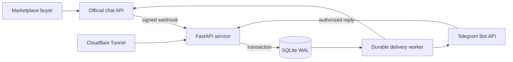

# Marketplace Telegram Bridge

[](https://github.com/santosgus3dtech/marketplace-telegram-bridge/actions/workflows/checks.yml)
[](https://www.python.org/)
[](https://fastapi.tiangolo.com/)

A secure, event-driven bridge between the official OLX Chat API and Telegram. It forwards
marketplace conversations to an authorized Telegram chat and sends replies back through the
official provider API.

This public repository is a sanitized portfolio edition. It contains no production credentials,
message history, database, personal identifiers, or private deployment configuration.

## Why this project matters

The interesting part is not moving text between two APIs. The service is designed around the
failure modes that appear in real integrations:

- duplicated or replayed webhooks;
- OAuth token rotation and encrypted persistence;
- slow or unavailable external APIs;
- process restarts during delivery;
- unauthorized Telegram users or chats;
- provider rate limits and transient failures;
- retention of message data and operational audit events.

## Architecture



Incoming webhooks persist the message and an outbox job in the same database transaction. A
background worker claims jobs with ownership locks, applies bounded exponential backoff, and
moves exhausted jobs to a dead-letter state. The HTTP request never waits for an external API.

## Engineering highlights

- Async FastAPI, HTTPX and SQLAlchemy 2.x.
- OAuth 2.0 with expiring, single-use `state` values.
- Encrypted provider tokens at rest.
- Idempotency for provider message IDs and Telegram update IDs.
- Durable outbox with restart recovery, lock timeouts and dead-letter handling.
- Telegram webhook secret plus chat and user allowlists.
- Request-size limits, local rate limiting and production OpenAPI hardening.
- SQLite WAL, Alembic migrations and online backup/restore scripts.
- Configurable retention for messages and audit records.
- Docker hardening: read-only filesystem, dropped capabilities and no-new-privileges.
- Unit, integration and end-to-end scenarios with external services mocked.

## Stack

`Python 3.12+` · `FastAPI` · `Pydantic Settings` · `SQLAlchemy` · `Alembic` ·
`SQLite` · `HTTPX` · `cryptography` · `pytest` · `Docker Compose` · `Cloudflare Tunnel`

## Local development

```bash
python -m venv .venv

# Linux/macOS
source .venv/bin/activate

# Windows PowerShell
.venv\Scripts\Activate.ps1

python -m pip install -e ".[dev]"
cp .env.example .env
```

Generate an encryption key and place it in `.env`:

```bash
python -c "from cryptography.fernet import Fernet; print(Fernet.generate_key().decode())"
```

For local checks, keep external credentials empty and run:

```bash
alembic upgrade head
uvicorn app.main:app --reload
```

Health endpoints:

- `GET /health` checks the process.
- `GET /ready` checks database access.

## Verification

```bash
ruff check .
ruff format --check .
pytest -q
```

The test suite covers OAuth, webhook validation, authorization, deduplication, delivery retries,
dead-letter behavior, retention, migrations and both message directions.

## Container deployment

```bash
cp .env.example .env
docker compose -f deploy/docker-compose.yml build app
docker compose -f deploy/docker-compose.yml run --rm --no-deps app alembic upgrade head
docker compose -f deploy/docker-compose.yml up -d app
bash scripts/check.sh
```

The example binds the service to loopback. A reverse proxy or tunnel should terminate HTTPS and
forward requests to that local port. Replace `bridge.example.com` in `.env` and the tunnel example
with a domain you control.

## Security model

Secrets belong only in `.env` or a secret manager. Never commit provider client secrets,
Telegram bot tokens, tunnel tokens or encryption keys. The application additionally enforces:

1. official APIs only, with no marketplace scraping;
2. a random OAuth state with TTL and one-time consumption;
3. encrypted provider tokens in the database;
4. Telegram chat and user allowlists;
5. reply correlation to a known marketplace message;
6. strict webhook and body-size validation;
7. bounded retries and explicit handling of permanent failures;
8. configurable removal of old message data.

See [`docs/ARCHITECTURE.md`](docs/ARCHITECTURE.md),
[`docs/SECURITY.md`](docs/SECURITY.md), and
[`docs/THREAT_MODEL.md`](docs/THREAT_MODEL.md) for the detailed design.

## Provider activation

The automated suite does not require live credentials. A real OLX deployment requires an approved
integration and credentials issued by the provider. Configure the callback and webhook URLs only
after HTTPS is available.

## Repository map

```text
app/
  api/          OAuth, health and webhook endpoints
  clients/      Provider and Telegram HTTP clients
  db/           Models, repositories and async sessions
  services/     Bridge, delivery, security and retention logic
alembic/        Database migrations
deploy/         Hardened Compose and tunnel examples
docs/           Architecture, API and security notes
scripts/        Operations, backup and webhook helpers
tests/          Unit, integration and end-to-end scenarios
```

## License

MIT License. See [`LICENSE`](LICENSE).
